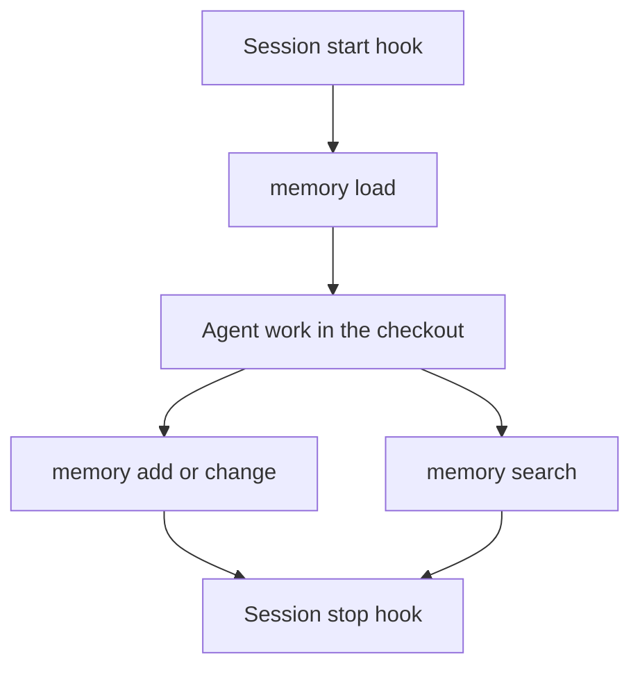

# Agent session

A session starts with a hook that loads standing facts, then the agent works against the checkout, then a stop hook can tidy.

```mermaid
flowchart TD
    Start[Session start hook] --> Load[memory load]
    Load --> Work[Agent work in the checkout]
    Work --> Add[memory add or change]
    Work --> Search[memory search]
    Add --> Stop[Session stop hook]
    Search --> Stop
```
