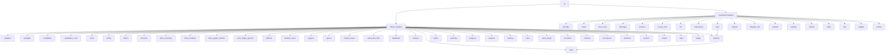

# Package architecture

The `memory` / `cairnkit` CLI dispatches into command modules. Shared helpers sit under library modules. Facts live outside the repo and are linked in as `memory-bank`.

```mermaid
flowchart TB
    CLI[cli] --> Commands[command modules]
    CLI --> Library[library modules]
    Commands --> autotidy[autotidy]
    Commands --> check[check]
    Commands --> docs_cmd[docs_cmd]
    Commands --> followups[followups]
    Commands --> hookrun[hookrun]
    Commands --> hooks_cmd[hooks_cmd]
    Commands --> init[init]
    Commands --> instructions[instructions]
    Commands --> load[load]
    Commands --> migrate[migrate]
    Commands --> migrate_refs[migrate_refs]
    Commands --> presets[presets]
    Commands --> reading[reading]
    Commands --> refresh[refresh]
    Commands --> skills[skills]
    Commands --> tidy[tidy]
    Commands --> update[update]
    Commands --> writing[writing]
    Library --> adapters[adapters]
    Library --> autogate[autogate]
    Library --> candidates[candidates]
    Library --> candidates_cmd[candidates_cmd]
    Library --> clock[clock]
    Library --> config[config]
    Library --> detect[detect]
    Library --> discover[discover]
    Library --> docs_inventory[docs_inventory]
    Library --> docs_modules[docs_modules]
    Library --> docs_pages_cairnkit[docs_pages_cairnkit]
    Library --> docs_pages_generic[docs_pages_generic]
    Library --> githook[githook]
    Library --> harness_local[harness_local]
    Library --> hygiene[hygiene]
    Library --> ignore[ignore]
    Library --> install_source[install_source]
    Library --> instruction_files[instruction_files]
    Library --> loopbreak[loopbreak]
    Library --> markers[markers]
    Library --> memory[memory]
    Library --> paths[paths]
    Library --> pending[pending]
    Library --> progress[progress]
    Library --> propose[propose]
    Library --> ranking[ranking]
    Library --> rules[rules]
    Library --> rules_target[rules_target]
    Library --> scenarios[scenarios]
    Library --> schema[schema]
    Library --> secretscan[secretscan]
    Library --> selection[selection]
    Library --> session[session]
    Library --> similar[similar]
    Library --> state[state]
    Library --> store[store]
    Library --> usage[usage]
    memory --> store
    load --> memory
```
