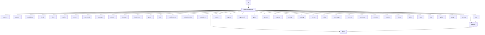

# Package architecture

The `memory` / `cairnkit` CLI dispatches into small modules. Facts live outside the repo and are linked in as `memory-bank`.

```mermaid
flowchart TB
    CLI[cli] --> Commands[command modules]
    Commands --> adapters[adapters]
    Commands --> autotidy[autotidy]
    Commands --> candidates[candidates]
    Commands --> check[check]
    Commands --> clock[clock]
    Commands --> config[config]
    Commands --> detect[detect]
    Commands --> docs_cmd[docs_cmd]
    Commands --> followups[followups]
    Commands --> githook[githook]
    Commands --> hookrun[hookrun]
    Commands --> hooks_cmd[hooks_cmd]
    Commands --> ignore[ignore]
    Commands --> init[init]
    Commands --> install_source[install_source]
    Commands --> instruction_files[instruction_files]
    Commands --> instructions[instructions]
    Commands --> load[load]
    Commands --> markers[markers]
    Commands --> memory[memory]
    Commands --> migrate[migrate]
    Commands --> migrate_refs[migrate_refs]
    Commands --> paths[paths]
    Commands --> presets[presets]
    Commands --> progress[progress]
    Commands --> ranking[ranking]
    Commands --> reading[reading]
    Commands --> refresh[refresh]
    Commands --> rules[rules]
    Commands --> rules_target[rules_target]
    Commands --> schema[schema]
    Commands --> secretscan[secretscan]
    Commands --> selection[selection]
    Commands --> session[session]
    Commands --> similar[similar]
    Commands --> skills[skills]
    Commands --> state[state]
    Commands --> store[store]
    Commands --> tidy[tidy]
    Commands --> update[update]
    Commands --> usage[usage]
    Commands --> writing[writing]
    memory --> store
    load --> memory
```
