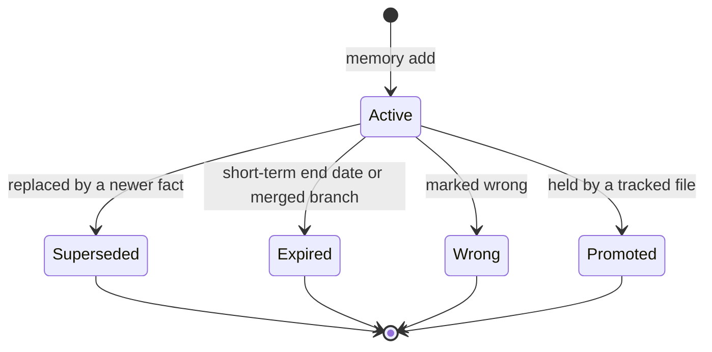

# Fact lifecycle

New facts are active. Later change records move them to another status. Nothing is deleted except a purge for secrets.

```mermaid
stateDiagram-v2
    [*] --> Active: memory add
    Active --> Superseded: replaced by a newer fact
    Active --> Expired: short-term end date or merged branch
    Active --> Wrong: marked wrong
    Active --> Promoted: held by a tracked file
    Superseded --> [*]
    Expired --> [*]
    Wrong --> [*]
    Promoted --> [*]
```
